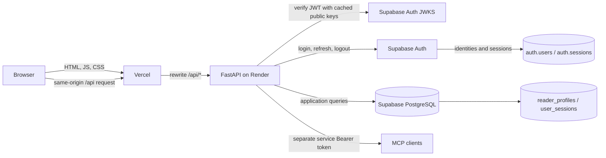
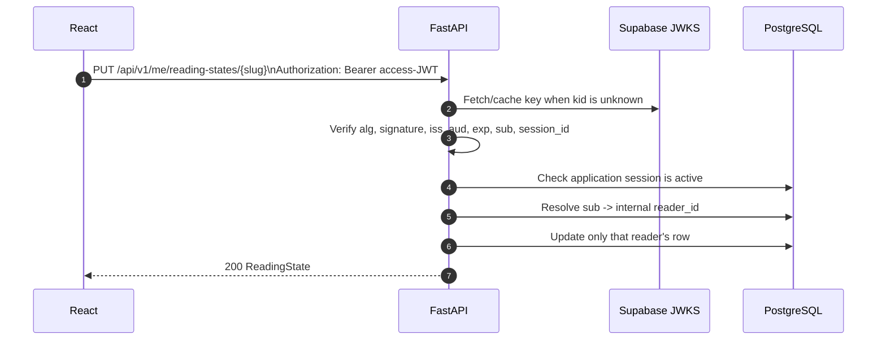
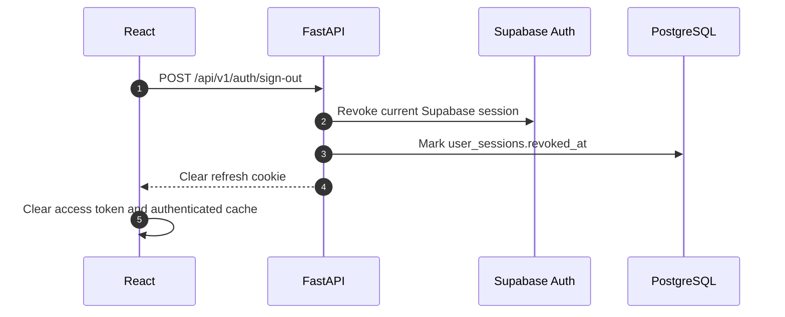
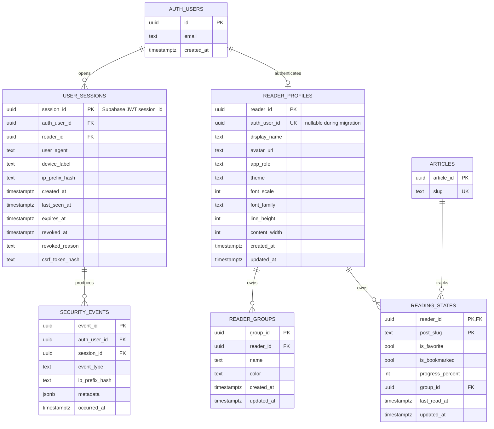
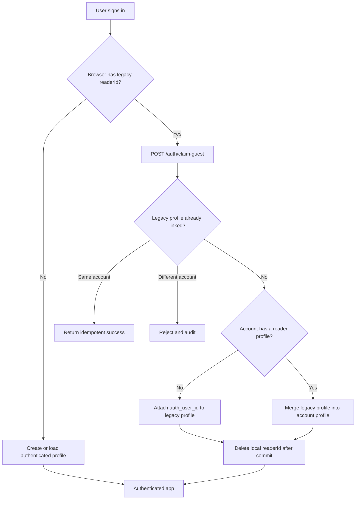
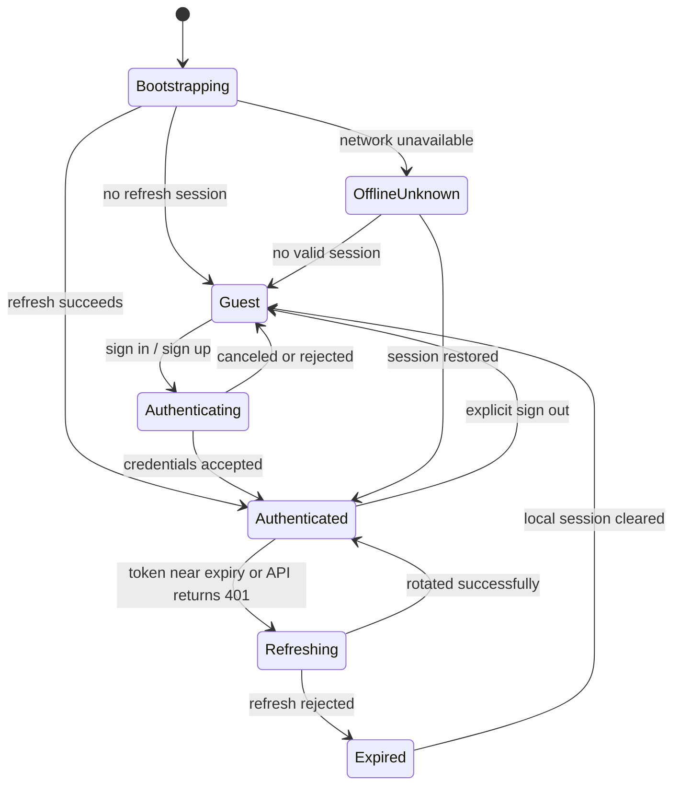

# Authentication and Session Architecture

**Status:** Proposed for review; no authentication code has been implemented.

**Last reviewed:** 2026-07-22

**Scope:** React/Vite frontend on Vercel, FastAPI API and MCP server on Render,
and PostgreSQL plus Auth on Supabase.

## 1. Executive decision

Blog Vault should use **Supabase Auth as the identity and token issuer**, with
FastAPI acting as the application authorization boundary.

We should not write our own password hashing, JWT signing, refresh-token format,
refresh-token rotation, or OAuth implementation. Supabase Auth already provides
those security-sensitive mechanisms and stores its own identities and sessions in
the private `auth` schema.

The recommended browser architecture is a small **Backend for Frontend (BFF)**
layer inside the existing FastAPI service:

- FastAPI receives login, callback, refresh, and logout requests.
- Supabase issues a short-lived JWT access token and a rotating refresh token.
- The access token is returned to React and kept **in memory only**.
- The refresh token is stored in a `Secure`, `HttpOnly` cookie and is never
  exposed to application JavaScript.
- React sends the access token in `Authorization: Bearer <token>`.
- FastAPI verifies the JWT signature and claims using the Supabase JWKS endpoint.
- FastAPI derives the user from the verified `sub` claim. A route never trusts a
  user ID supplied by the browser.
- An application-owned `user_sessions` row mirrors the Supabase `session_id`
  claim so users can inspect and revoke individual devices.
- Public articles and public learning-path definitions remain readable without
  authentication. Personal state requires authentication.

This design requires browser API calls to be same-origin in production. Vercel
should proxy `/api/*` to Render, or the two services should use sibling custom
domains. Direct cross-site refresh cookies between `*.vercel.app` and
`*.onrender.com` are not reliable because browser third-party-cookie policies can
block them.

### Recommended initial product policy

| Decision | Recommendation |
| --- | --- |
| Public reading | Allowed without an account |
| Saved progress, groups, favorites, bookmarks | Account required for cloud sync |
| Guest state | Kept locally and offered for import after sign-in |
| Initial sign-in methods | Google or GitHub OAuth, plus email/password if custom SMTP is configured |
| Access-token lifetime | 30 minutes |
| Application inactivity limit | 30 days |
| Application absolute session lifetime | 90 days |
| Concurrent sessions | Allowed; users can view and revoke devices |
| Admin review access | Authenticated `admin` role plus TOTP MFA |
| MCP authoring access | Remains a separate service credential in the first release |

## 2. Why authentication is needed

The current reader model is anonymous. React generates a UUID and stores it as
`readerId` in `localStorage`. Requests then include that value in routes such as:

```text
GET /api/v1/readers/{reader_id}/reading-states
PUT /api/v1/readers/{reader_id}/preferences
```

The API accepts the supplied UUID as ownership. A UUID is difficult to guess, but
it is only an identifier and must not be treated as proof of identity. Anyone who
obtains it can read or modify that profile. It also does not support:

- using the same library on multiple devices;
- securely recovering an account;
- revoking one lost device;
- distinguishing readers from administrators;
- reliably attributing review actions;
- deleting or exporting one user's data;
- preventing horizontal authorization failures.

The authentication migration must therefore change both identity and API shape.
Adding a login screen while continuing to trust `{reader_id}` would not fix the
underlying authorization problem.

## 3. Terminology

| Term | Meaning in Blog Vault |
| --- | --- |
| Authentication | Proving which Supabase user is making a request. |
| Authorization | Deciding whether that authenticated user may perform an action. |
| Access token | Short-lived, signed Supabase JWT presented to FastAPI. |
| Refresh token | Long-lived, single-use token exchanged for a new token pair. |
| Supabase session | The identity-provider session represented by an access token, refresh token, and `auth.sessions` row. |
| Application session | Our metadata and revocation row keyed by the JWT `session_id`. |
| Principal | The verified user and session information injected into a FastAPI request. |
| Guest | A browser that can read public content but has no authenticated cloud identity. |
| BFF | Backend endpoint set that mediates browser authentication and keeps the refresh token out of JavaScript. |

### A practical mental model

“JWT authentication” and “sessions” are not competing choices here. We use both:

- The **access JWT** is a short-lived, signed pass. FastAPI can validate it
  without asking Supabase on every request. It contains claims, but is not an
  encrypted container; clients can read its payload, so secrets never belong in
  JWT claims.
- The **refresh token** is a long-lived bearer secret. It cannot call Blog Vault
  APIs directly. It can only be exchanged with Supabase for a fresh token pair.
- The **Supabase session** is the provider's refresh-token family and session row.
- The **Blog Vault session row** adds product-specific device display, lifetime,
  auditing, and immediate revocation.

Possession of a valid access JWT proves that Supabase authenticated the subject
for a bounded period. It does not by itself answer whether the user may publish an
article, whether the device was revoked, or which database rows belong to them.
Those remain application authorization decisions.

## 4. Options considered

### Option A: custom FastAPI JWT and refresh-token system

FastAPI would store password hashes, sign JWTs, create refresh-token families,
rotate tokens, detect reuse, send verification email, implement password resets,
and provide OAuth integrations.

**Rejected.** This creates the most security-critical code in the application
without providing a product advantage. Correct refresh-token family invalidation,
key rotation, account recovery, enumeration resistance, and provider linking are
easy to get subtly wrong.

### Option B: Supabase Auth directly from the React SPA

React would use `@supabase/supabase-js`, persist the entire Supabase session in
browser storage, refresh automatically, and send the access JWT to FastAPI.

**Viable fallback.** It is simple and fits a static SPA. Its main cost is that a
long-lived refresh token is accessible to any JavaScript executing on the origin.
An XSS flaw could exfiltrate the session. Our sanitized article pipeline and
sandboxed interactive documents reduce that risk, but do not eliminate it.

### Option C: Supabase Auth with a FastAPI BFF

FastAPI mediates authentication. React holds only a short-lived access token in
memory, while a rotating refresh token stays in an `HttpOnly` cookie.

**Recommended.** It minimizes credential exposure while preserving the current
React/FastAPI split. It adds refresh and CSRF handling, but that code coordinates
tokens rather than inventing their cryptography or lifecycle.

### Comparison

| Concern | Custom auth | Direct SPA | Supabase + BFF |
| --- | --- | --- | --- |
| Password/token security burden | Highest | Supabase-managed | Supabase-managed |
| Refresh token visible to JS | Depends | Yes | No |
| Works across separate free-host domains | Yes | Yes | Needs same-origin proxy |
| Session/device dashboard | Custom | Custom mirror | Custom mirror |
| OAuth and email verification | Custom | Supabase | Supabase |
| Implementation complexity | Highest | Lowest | Medium |
| Recommended | No | Only if proxy is blocked | Yes |

## 5. Target system architecture



### Trust boundaries

1. Everything received from the browser is untrusted, including UUIDs, profile
   values, JWT payloads before verification, redirect URLs, and device labels.
2. A signed JWT is not trusted until signature, issuer, audience, time, user, and
   session claims are validated.
3. `user_metadata` is user-editable and must never grant an admin role.
4. The Supabase publishable key is allowed in the frontend. The Supabase secret
   key, database credentials, cookie/CSRF secrets, MCP token, and break-glass
   admin token are server-only.
5. Published article HTML is sanitized. Interactive HTML remains isolated in a
   sandboxed iframe and must never execute in the application origin.
6. MCP authoring authority is distinct from reader identity. Signing up must not
   grant MCP access or article-writing capability.

## 6. Authentication flows

### 6.1 Email/password sign-in

```mermaid
sequenceDiagram
    autonumber
    participant U as User
    participant R as React
    participant F as FastAPI BFF
    participant S as Supabase Auth
    participant D as PostgreSQL

    U->>R: Submit email and password
    R->>F: POST /api/v1/auth/sign-in
    Note over R,F: Same-origin request, CSRF and Origin checked
    F->>S: signInWithPassword
    S-->>F: access JWT + rotating refresh token + user
    F->>F: Verify returned identity and extract session_id
    F->>D: Upsert profile and application session
    F-->>R: Set HttpOnly refresh cookie; return access JWT + user
    R->>R: Keep access JWT in memory only
    R->>F: GET /api/v1/me with Bearer JWT
    F-->>R: Personalized profile
```

Passwords must never be stored or logged by Blog Vault. Request-body logging and
Langfuse capture must redact password, access token, refresh token, authorization,
cookie, PKCE verifier, and recovery fields.

### 6.2 OAuth authorization-code flow with PKCE

```mermaid
sequenceDiagram
    autonumber
    participant U as User
    participant R as React
    participant F as FastAPI BFF
    participant S as Supabase Auth
    participant O as OAuth Provider

    U->>R: Continue with Google/GitHub
    R->>F: POST /api/v1/auth/oauth/start
    F->>F: Create state + PKCE verifier
    F-->>R: Set short-lived HttpOnly state/verifier cookies; return redirect
    R->>S: Navigate to authorization URL
    S->>O: Provider authorization
    O-->>S: Authorization result
    S-->>F: Redirect callback with one-time code and state
    F->>F: Verify state and callback allowlist
    F->>S: Exchange code + PKCE verifier
    S-->>F: access JWT + refresh token
    F-->>R: Set refresh cookie; redirect to fixed app URL
```

Only exact configured callback URLs are allowed. A request-supplied `return_to`
must be matched against a small relative-path allowlist to prevent open redirects.

### 6.3 Authenticated API request



The JWT payload may be decoded for diagnostics, but decoded claims must never be
used for authorization until verification succeeds.

### 6.4 Refresh-token rotation

```mermaid
sequenceDiagram
    autonumber
    participant R as React
    participant F as FastAPI BFF
    participant S as Supabase Auth
    participant D as PostgreSQL

    R->>F: POST /api/v1/auth/refresh\nCSRF header + automatic HttpOnly cookie
    F->>F: Validate Origin and CSRF token
    F->>S: Exchange refresh token
    S-->>F: New access JWT + new refresh token
    F->>D: Update session last_seen_at
    F-->>R: Replace refresh cookie; return access JWT
    R->>R: Replace in-memory access JWT
```

React must use a single-flight refresh promise. If several requests receive 401
simultaneously, only one refresh call is permitted; the other requests wait and
retry once. This avoids races with single-use refresh tokens. Supabase applies
refresh-token rotation and reuse detection, including a short reuse interval for
legitimate network races.

Refresh failure is terminal for the local session:

1. clear the in-memory access token;
2. call the cookie-clearing endpoint if possible;
3. change the UI to signed-out state;
4. preserve unsent reading updates locally;
5. never loop indefinitely between 401 and refresh.

### 6.5 Sign-out and device revocation



Supabase access JWTs remain cryptographically valid until they expire even after
logout. The application-session check provides immediate Blog Vault revocation.
For a low-risk read request, accepting the token until expiry is an available
performance tradeoff, but all personal writes and admin operations must enforce
the application-session state.

## 7. JWT validation contract

FastAPI should expose one dependency such as `AuthenticatedPrincipal` and make it
the only supported entry point for user identity.

Required validation:

| Check | Required behavior |
| --- | --- |
| Header algorithm | Explicit allowlist matching the Supabase asymmetric key configuration. Never accept `none`. |
| `kid` | Select a matching key from JWKS; refetch once for an unknown key. |
| Signature | Verify with a maintained JOSE library, never handwritten crypto. |
| `iss` | Exact Supabase project Auth issuer. |
| `aud` | Expected authenticated audience. |
| `exp` and `nbf` | Reject expired/not-yet-valid tokens with a small bounded clock tolerance. |
| `sub` | Required UUID; becomes `auth_user_id`. |
| `session_id` | Required UUID; maps to the application session. |
| `role` | Must represent an authenticated user, but does not grant Blog Vault admin rights. |
| `aal` | Require `aal2` for privileged administrator operations after MFA rollout. |

JWKS should be cached with bounded lifetime and refreshed on an unknown `kid`.
FastAPI must not verify user JWTs with the Supabase secret API key or legacy
shared JWT secret. Asymmetric public-key verification limits blast radius and
supports key rotation.

Suggested principal value object:

```text
AuthenticatedPrincipal
  auth_user_id: UUID       # verified JWT sub
  reader_id: UUID          # internal profile key
  session_id: UUID         # verified JWT session_id
  role: reader | admin     # loaded from application-owned data
  assurance_level: aal1 | aal2
```

## 8. Token and cookie handling

### Access token

- Lifetime: 30 minutes initially.
- Storage: React memory only; never `localStorage`, `sessionStorage`, IndexedDB,
  URL parameters, query strings, analytics, or logs.
- Transport: `Authorization: Bearer` over HTTPS.
- Page reload: call the refresh endpoint using the HttpOnly cookie.
- Retry: retry the failed request once after a successful refresh.

### Refresh token

- Issued and rotated by Supabase.
- Stored only in a cookie such as `__Host-blog_refresh`.
- Attributes: `Secure; HttpOnly; SameSite=Lax; Path=/` with no `Domain`.
- Never returned in JSON, logged, hashed into telemetry, or stored in our tables.
- Replaced atomically on every successful refresh.
- Cleared with identical cookie attributes on logout or refresh failure.

`__Host-` requires `Secure`, `Path=/`, and no `Domain`. If a narrow cookie path is
preferred, use a `__Secure-` prefix instead and document the reduced constraint.

### CSRF

Bearer-authenticated application requests are not automatically authenticated by
the browser, but refresh/logout requests use a cookie and therefore need CSRF
protection.

Use all of the following:

- exact production `Origin` validation on state-changing auth endpoints;
- `SameSite=Lax` on the refresh cookie;
- a random CSRF token, readable by React and sent in an `X-CSRF-Token` header;
- a server-side hash of that CSRF token bound to `session_id`;
- POST only for refresh and logout;
- no permissive CORS origin when credentials are enabled.

CSRF controls do not protect against XSS. Content sanitization, iframe isolation,
a strict Content Security Policy, dependency control, and no unsafe token storage
remain mandatory.

## 9. Proposed data model

Supabase owns `auth.users`, `auth.identities`, refresh-token state, and
`auth.sessions`. Blog Vault owns application profile, authorization, device
metadata, and audit records.

### Transitional entity relationship diagram



### Why keep both `reader_id` and `auth_user_id` initially?

Existing rows already reference browser-generated `reader_id` values. Adding a
nullable, unique `auth_user_id` lets an authenticated user claim that complete
profile without rewriting every foreign key in the same deployment.

After the migration window, a later cleanup may rename the internal key to
`user_id` or rebuild the tables around `auth.users.id`. That cleanup is optional;
keeping a stable internal profile ID also decouples application data from the
identity provider.

### Table-level details

#### `reader_profiles` additions

```sql
auth_user_id uuid null unique references auth.users(id) on delete cascade,
display_name varchar(80) null,
avatar_url varchar(500) null,
app_role varchar(20) not null default 'reader',
created_at timestamptz not null default now(),
constraint ck_reader_profile_role check (app_role in ('reader', 'admin'))
```

Only server-side administration may change `app_role`. OAuth/user metadata must
not be copied into it as an authority decision.

#### `user_sessions`

```sql
session_id uuid primary key,
auth_user_id uuid not null references auth.users(id) on delete cascade,
reader_id uuid not null references reader_profiles(reader_id) on delete cascade,
user_agent varchar(512) null,
device_label varchar(100) null,
ip_prefix_hash char(64) null,
created_at timestamptz not null default now(),
last_seen_at timestamptz not null default now(),
expires_at timestamptz not null,
revoked_at timestamptz null,
revoked_reason varchar(40) null,
csrf_token_hash char(64) not null,
constraint ck_session_expiry check (expires_at > created_at)
```

Indexes:

- `(auth_user_id, revoked_at, last_seen_at desc)` for the device screen;
- `(reader_id)` for cascade/ownership joins;
- the primary-key index on `session_id` for request checks.

Do not store either token. `session_id` is an identifier, not the refresh secret.

`last_seen_at` should be updated at most once every five minutes per session to
avoid turning every article request into an additional database write.

#### `security_events`

Suggested event types:

```text
sign_in_succeeded
sign_in_failed
session_refreshed
session_revoked
signed_out
guest_profile_claimed
password_changed
mfa_enrolled
mfa_removed
admin_action_denied
```

Do not put email addresses, IP addresses, tokens, cookies, passwords, or article
content in event metadata. Retain events for 90 days initially, then delete them
with a scheduled maintenance job.

### IP and device privacy

Raw IP addresses are not needed for this product. If readers benefit from a
rough “recognize this session” signal, store a keyed HMAC of a truncated network
prefix rather than the address itself. Rotate the HMAC key deliberately; a key
rotation makes historical values unlinkable.

User-Agent strings can be personal data. Cap their length, normalize control
characters, display only a coarse browser/OS label, and apply the same retention
period as the session row.

## 10. API redesign

### Public endpoints

These remain unauthenticated and read-only:

```text
GET /api/v1/health
GET /api/v1/posts
GET /api/v1/posts/{slug}
GET /api/v1/posts/{slug}/experience
GET /api/v1/learning-paths
```

### Auth lifecycle endpoints

```text
POST   /api/v1/auth/sign-up
POST   /api/v1/auth/sign-in
POST   /api/v1/auth/oauth/start
GET    /api/v1/auth/callback
POST   /api/v1/auth/refresh
POST   /api/v1/auth/sign-out
GET    /api/v1/auth/me
GET    /api/v1/auth/sessions
DELETE /api/v1/auth/sessions/{session_id}
DELETE /api/v1/auth/sessions                 # revoke all other sessions
POST   /api/v1/auth/claim-guest
```

### Authenticated reader endpoints

Replace browser-controlled reader IDs with `/me`:

```text
GET /api/v1/me/preferences
PUT /api/v1/me/preferences
GET /api/v1/me/reading-states
PUT /api/v1/me/reading-states/{post_slug}
GET /api/v1/me/groups
POST /api/v1/me/groups
PUT /api/v1/me/groups/{group_id}
DELETE /api/v1/me/groups/{group_id}
GET /api/v1/me/learning-paths
```

Repository methods may still use the internal `reader_id`, but it is resolved by
the authentication dependency. It is never copied from a path, query parameter,
or request body.

### Error contract

| Status | Meaning |
| --- | --- |
| `400` | Malformed auth operation or invalid callback state. |
| `401` | Access token absent, invalid, expired, or session revoked. |
| `403` | Authenticated but role or assurance level is insufficient. |
| `409` | Guest profile already claimed or merge conflict. |
| `422` | Valid request shape but unacceptable user input. |
| `429` | Authentication or claim rate limit reached. |
| `503` | Identity provider temporarily unavailable for a flow that requires it. |

Responses should be intentionally nonspecific where detailed errors enable email
enumeration. Internal logs may contain a safe error code, never credentials.

## 11. Existing anonymous-reader migration

Existing data must not disappear when authentication launches.

### Guest claim flow



### Merge rules

The claim operation must run in one database transaction and be idempotent.

| Data | Merge rule |
| --- | --- |
| Reading progress | Keep the maximum percentage. |
| Favorite/bookmark | Logical OR. |
| Last read time | Keep the latest timestamp. |
| Group names | Match case-insensitively; create missing groups. |
| Conflicting group membership | Prefer the account profile and report the conflict. |
| Theme/typography | Prefer the current browser's guest settings on first claim only. |
| Learning-path progress | Automatically follows merged reading state. |

The current UUID is the only capability existing guests possess. It has high
entropy but is not strong proof of ownership. Claims should therefore be offered
only during a limited migration window, rate-limited per account and network,
and recorded as a security event. We cannot retroactively add a second secret to
browsers that already exist.

After the migration window:

1. remove public `/readers/{reader_id}` endpoints;
2. reject new anonymous database profiles;
3. keep guest state only in browser storage;
4. delete unclaimed anonymous server data after a documented retention period.

## 12. Authorization and roles

Authentication alone does not authorize article administration.

### Reader

- read public posts and paths;
- manage only their own preferences, progress, bookmarks, favorites, and groups;
- list and revoke only their own sessions;
- export or delete only their own account data.

### Admin

- all reader privileges;
- access the article review dashboard;
- comment, approve, publish, discard, and roll back;
- requires `app_role = 'admin'` loaded from the database;
- should require `aal2` TOTP MFA for privileged operations.

The existing shared `BLOG_ADMIN_ACCESS_TOKEN` should become a short-lived
break-glass credential during migration and then be disabled. Shared permanent
admin tokens prevent individual attribution and device revocation.

### MCP service identity

The existing MCP Bearer credential remains separate. It authorizes an automation
service, not a human reader session. In a future multi-author product, MCP should
use delegated OAuth scopes such as `articles:read`, `articles:draft`, and
`reviews:reply`; reader JWTs must not silently become authoring credentials.

## 13. Database authorization nuance

Supabase Row Level Security is valuable, but `auth.uid()` policies apply naturally
when requests reach PostgREST with a user's JWT. The current FastAPI service uses
a direct SQLAlchemy database connection. If that connection uses a database-owner
or bypass-RLS role, adding an RLS policy alone does not protect application
queries.

The first mandatory protection is therefore:

- verified principal dependency;
- no caller-supplied owner ID;
- ownership predicate on every personal query;
- database constraints and foreign keys;
- IDOR-focused integration tests.

For stronger defense in depth, create separate database identities:

- migration role: owns schema changes and never serves web requests;
- runtime `blog_api` role: least privilege and no `BYPASSRLS`;
- per-transaction `SET LOCAL app.reader_id = ...`;
- RLS policies compare row ownership with that transaction setting.

This separation should happen after the authentication routes work, because it
changes deployment credentials and every transaction boundary.

## 14. Frontend experience and state machine

### User-facing surfaces

- sign-in/sign-up screen or modal;
- OAuth provider buttons;
- email verification and password-reset states;
- account/avatar menu in place of the fixed `M` avatar;
- session/device management screen;
- sign-out-current-device and sign-out-all-devices actions;
- guest banner explaining that progress is local until sign-in;
- one-time “Import this browser's reading history?” prompt;
- sync state that distinguishes saved, offline, authentication expired, and
  conflict states;
- admin navigation visible only after the server returns the admin role.

### Client authentication state



Protected UI must wait for bootstrap to finish. Rendering the app as “guest” for
one frame and then switching to the authenticated account causes data flashes and
can trigger writes against the wrong identity.

### Offline behavior

- Public article reading remains available when cached.
- Guest progress can queue locally.
- Authenticated writes queued offline include the owning auth user ID and must be
  discarded or explicitly reassigned if a different user signs in.
- Never replay queued mutations after logout without re-confirming the principal.
- Resolve reading progress using max percentage; do not allow a stale offline
  update to lower server progress.

## 15. Session dashboard behavior

Each row should show only information useful to the account owner:

- “This device” badge;
- coarse browser and operating system;
- first signed-in time;
- last active time;
- optional user-selected device label;
- revoked or expired state.

Actions:

- revoke one other session;
- revoke all other sessions;
- sign out this device;
- optionally report “I do not recognize this session,” which revokes all sessions
  and recommends changing password/enabling MFA.

Do not show precise location unless we intentionally add a trusted GeoIP service
and privacy policy. It is unnecessary for the first release.

## 16. Session expiry policy

Supabase Free does not include every hosted session-lifetime control. Because the
BFF handles refresh, Blog Vault can enforce its own policy before exchanging a
refresh token:

```text
access JWT lifetime:        30 minutes
idle session lifetime:      30 days since last_seen_at
absolute session lifetime:  90 days since created_at
admin idle lifetime:        12 hours
admin absolute lifetime:    7 days
```

These are starting values, not universal truths. A personal reading library is
low risk, so frequent login prompts would be counterproductive. Admin publication
actions have a larger impact and deserve shorter limits plus MFA.

Clock comparisons must happen on the server. UI timers improve messaging but are
not security boundaries.

## 17. Security threat model

| Threat | Example | Required mitigation |
| --- | --- | --- |
| IDOR | Change a UUID in a URL to access another library. | `/me` routes; identity from verified `sub`; ownership query tests. |
| JWT forgery | Change `role` or `sub` in a decoded token. | JWKS signature and full claim validation; algorithm allowlist. |
| Access-token theft | XSS reads an in-memory JWT. | Short lifetime, CSP, sanitization, iframe sandboxing, session revoke. |
| Refresh-token theft | Script or logs capture a long-lived token. | HttpOnly cookie; redaction; rotation/reuse detection; no app storage. |
| CSRF | Malicious site invokes refresh or logout with cookies. | SameSite cookie, exact Origin validation, CSRF header/token. |
| Session fixation | Attacker forces a known pre-login identity. | New Supabase session on login; controlled one-time guest claim. |
| Refresh race/replay | Multiple tabs exchange the same refresh token. | Client single-flight, provider reuse window, terminate suspicious family. |
| Credential stuffing | Automated password attempts. | Supabase rate limits, CAPTCHA when needed, OAuth, MFA for admins. |
| Email enumeration | Sign-up/reset errors reveal membership. | Generic responses and consistent timing where practical. |
| Stale JWT after logout | Revoked access token remains valid until `exp`. | Application session revocation check; short JWT lifetime. |
| Open redirect | Callback sends user to attacker-controlled site. | Fixed callback and relative return-path allowlist. |
| Privilege escalation | User edits OAuth metadata to `admin`. | Role stored in server-owned application table, not user metadata. |
| Service-key leak | Supabase secret bundled by Vite. | Never prefix secrets with `VITE_`; deployment secret scanning. |
| Observability leak | Langfuse/error logs capture credentials. | Central redaction tests for headers, cookies, bodies, and URL params. |
| Malicious article | Interactive post escapes into app origin. | Sanitized reading HTML, sandboxed iframe, restrictive CSP. |

## 18. Rate limiting and abuse controls

Supabase rate-limits Auth endpoints, but Blog Vault should also rate-limit BFF
routes so an attacker cannot use Render as an unrestricted relay.

Recommended initial buckets:

- sign-in: 10 attempts per 15 minutes per normalized email hash and IP bucket;
- sign-up: 5 per hour per IP bucket;
- password reset: always return a generic response, 3 per hour per account/IP;
- refresh: 60 per hour per session with allowance for normal bursts;
- guest claim: 3 attempts per account per day;
- session revoke: 20 per hour per account.

Limits should produce `429` with a bounded `Retry-After`. Avoid storing raw email
or IP in limiter keys; use a keyed HMAC. CAPTCHA is an escalation after observed
abuse, not a default obstacle for every reader.

## 19. Email, OAuth, recovery, and MFA

### Email

Hosted Supabase projects require email confirmation by default. Its built-in
sender is intended for trial usage and has a low sending limit, so production
email/password auth requires custom SMTP and branded verification/reset templates.

### OAuth

Google is the broadest initial provider. GitHub is also appropriate for the likely
technical audience. Account-linking behavior must be tested so one verified email
does not accidentally create duplicate profiles.

### Password recovery

- generic response whether an account exists or not;
- one-time, expiring provider-controlled recovery flow;
- fixed allowlisted redirect;
- revoke other sessions after a successful password change;
- require recent authentication for email or password changes.

### MFA

TOTP is recommended for admins before replacing the shared review token. The
backend checks the verified JWT `aal` claim and refuses privileged actions unless
it is `aal2`. MFA can remain optional for ordinary readers initially.

## 20. Deployment topology changes

### Production request shape

Browser code should use a relative API root:

```text
VITE_API_URL=/api/v1
```

Vercel must route API requests to the Render origin before its SPA fallback. The
exact destination should be centralized and must not expose a secret. The stable
Vercel production hostname must be configured as a Supabase Site URL and OAuth
redirect URL.

Preview deployments need an explicit policy. Do not allow broad arbitrary OAuth
redirect wildcards. Either:

- disable real authentication on preview deployments;
- maintain a specific staging project and callback;
- or use a controlled preview callback broker.

### Required environment variables

Frontend-safe:

```text
VITE_API_URL=/api/v1
```

FastAPI-only:

```text
BLOG_SUPABASE_URL
BLOG_SUPABASE_PUBLISHABLE_KEY
BLOG_SUPABASE_SECRET_KEY
BLOG_SUPABASE_JWT_ISSUER
BLOG_SUPABASE_JWT_AUDIENCE
BLOG_AUTH_COOKIE_SECURE=true
BLOG_AUTH_ALLOWED_ORIGINS=["https://your-production-domain"]
BLOG_CSRF_HMAC_SECRET
BLOG_IP_HMAC_SECRET
```

The Supabase secret key is used only for trusted admin operations such as forced
session revocation or account deletion. Most JWT verification uses public JWKS.

Use separate production and development Supabase projects if possible. At a
minimum, use different OAuth redirect lists, secrets, and cookie security settings.

## 21. Implementation plan

Each phase should be separately reviewable and deployable.

### Phase 0: deployment foundation

1. Deploy Vercel and Render with stable URLs.
2. Route browser `/api/*` through the same-origin production hostname.
3. Confirm cookie forwarding and clearing on Chrome, Safari, and Firefox manually.
4. Add CSP and security headers before tokens are present.

**Exit criterion:** a non-sensitive test cookie can be set and cleared through the
production proxy without cross-site-cookie warnings.

### Phase 1: Supabase Auth configuration

1. Enable asymmetric JWT signing keys.
2. Set Site URL and exact redirect URLs.
3. Configure Google and/or GitHub OAuth.
4. Decide whether email/password ships in v1.
5. If yes, configure custom SMTP, email verification, reset templates, password
   minimums, and rate limits.
6. Keep email confirmation enabled.

**Exit criterion:** test users can authenticate in the Supabase test environment,
and keys/redirects are documented without committing secrets.

### Phase 2: schema migration

1. Add nullable unique `auth_user_id` and profile fields.
2. Add `user_sessions` and `security_events`.
3. Add constraints and indexes.
4. Preserve every existing anonymous profile.
5. Add downgrade/rollback logic where safe.

**Exit criterion:** Alembic check passes and existing 13-article reader data is
unchanged.

### Phase 3: backend authentication boundary

1. Add typed auth settings.
2. Add Supabase Auth client isolated from repositories.
3. Add JWT/JWKS verifier and `AuthenticatedPrincipal` dependency.
4. Add application-session checks.
5. Add auth lifecycle endpoints and CSRF controls.
6. Add log and Langfuse redaction tests.
7. Add structured, generic auth errors.

**Exit criterion:** protected endpoints reject missing, malformed, expired,
wrong-issuer, wrong-audience, revoked-session, and insufficient-role tokens.

### Phase 4: `/me` API migration

1. Add authenticated `/me` endpoints beside legacy endpoints.
2. Resolve `reader_id` only from the principal.
3. Add IDOR tests for every personal resource.
4. Change learning-path progress to the authenticated reader.
5. Mark legacy reader routes deprecated.

**Exit criterion:** no authenticated handler accepts an owner ID from the browser.

### Phase 5: React authentication

1. Add an auth provider/state machine.
2. Keep the access JWT in memory.
3. Add single-flight refresh and one-retry request behavior.
4. Build sign-in, callback, verification, recovery, and sign-out states.
5. Change API calls from `/readers/{id}` to `/me`.
6. Add account and session UI.
7. Preserve guest usability and offline state.

**Exit criterion:** reload, token expiry, offline recovery, logout, and multi-tab
behavior are manually verified without credential persistence in web storage.

### Phase 6: guest-data claim

1. Detect the legacy local `readerId` after successful authentication.
2. Offer an explicit import.
3. Implement transactional, idempotent merge rules.
4. Remove the legacy ID only after committed success.
5. Record a safe security event.

**Exit criterion:** existing bookmarks, groups, preferences, and maximum reading
progress survive sign-in and appear on a second device.

### Phase 7: admin identity migration

1. Assign the owner account `admin` through a server-only operation.
2. Add TOTP enrollment and `aal2` enforcement.
3. Attribute review comments/actions to a user ID.
4. retain the old admin token as documented break-glass access briefly;
5. remove the shared token from normal UI and rotate/delete it.

**Exit criterion:** the review dashboard has individual, MFA-protected attribution.

### Phase 8: hardening and cleanup

1. Remove anonymous server writes and legacy routes after the migration window.
2. Purge unclaimed anonymous profiles according to retention policy.
3. Add separate migration and runtime database roles.
4. Add RLS defense in depth if using a non-bypass runtime role.
5. Perform dependency, header, cookie, CSP, IDOR, and abuse reviews.
6. Document account export and deletion.

## 22. Verification strategy

The project intentionally does not use Playwright. Browser verification remains a
human review step.

### Automated backend tests

- JWT signature and claim validation;
- JWKS key rotation and unknown `kid` refresh;
- expired/not-yet-valid/wrong issuer/wrong audience tokens;
- revoked and expired application sessions;
- every `/me` ownership boundary;
- admin role and `aal2` requirements;
- refresh cookie attributes and replacement;
- CSRF and Origin rejection;
- guest merge idempotency and conflict rules;
- token/password/cookie telemetry redaction;
- rate-limit behavior;
- database cascades and uniqueness constraints.

### Automated frontend tests

- auth state reducer/state machine;
- one refresh for concurrent 401 responses;
- exactly one retry after refresh;
- queued writes never cross user boundaries;
- guest/import banners and failure states;
- route guards do not rely only on hidden UI.

### Manual browser matrix

| Scenario | Chrome | Safari | Firefox | Mobile Safari/Chrome |
| --- | --- | --- | --- | --- |
| First login | Required | Required | Required | Required |
| Refresh after page reload | Required | Required | Required | Required |
| Access-token expiry while reading | Required | Required | Required | Required |
| Logout and cookie clearing | Required | Required | Required | Required |
| Revoke another device | Required | Sample | Sample | Required |
| OAuth callback | Required | Required | Required | Required |
| Guest data claim | Required | Sample | Sample | Required |
| Offline then reconnect | Required | Required | Sample | Required |

Browser developer tools should confirm:

- no token in Local Storage, Session Storage, IndexedDB, URL, or console;
- refresh cookie is `Secure`, `HttpOnly`, and correct `SameSite`;
- access token appears only in the intended Authorization request header;
- CORS and CSP do not allow unapproved origins/scripts;
- logout clears the cookie with an identical name/path/domain policy.

## 23. Observability and operations

Metrics:

- sign-in success/failure counts by safe reason code;
- refresh success/failure and reuse detection;
- active application sessions;
- revoked sessions;
- 401/403/429 counts by endpoint;
- guest-claim success/conflict counts;
- identity-provider latency and availability.

Alerts:

- sudden increase in sign-in failures or refresh failures;
- repeated JWT verification failures for one issuer/key;
- admin authorization denials;
- a secret-looking value detected by telemetry redaction tests;
- Supabase Auth or database health degradation.

Never use email, name, raw IP, JWT, refresh token, cookie, or password as a metric
label. High-cardinality and sensitive labels are both operational hazards.

### Incident response basics

1. Compromised access token: revoke application session; token becomes unusable in
   Blog Vault immediately and expires cryptographically soon.
2. Compromised refresh token: revoke the Supabase session and application row;
   rotate associated credentials if logging exposure is suspected.
3. Compromised Supabase secret key: rotate it immediately, audit admin actions,
   and redeploy server secrets.
4. Compromised signing key: follow Supabase key rotation/revocation procedure and
   purge FastAPI JWKS caches.
5. XSS incident: invalidate sessions, disable affected article/experience,
   preserve evidence without retaining tokens, and tighten CSP/sanitization.

## 24. Account lifecycle

### Account export

Provide a machine-readable export containing profile preferences, reading state,
groups, and session/security history appropriate for disclosure. It must not
contain provider secrets or internal tokens.

### Account deletion

Require recent authentication and, for admins, MFA. The deletion flow should:

1. revoke all sessions;
2. delete the Supabase Auth user using a server-only admin call;
3. cascade application profile, reading state, groups, and session rows;
4. preserve only legally/operationally required de-identified audit records;
5. confirm completion without revealing internal identifiers.

An admin account that is the last administrator must not be self-deleted until a
replacement is assigned or a deliberate break-glass procedure is used.

## 25. Decisions required before implementation

Please approve or change these choices:

1. **Auth methods:** Google + GitHub OAuth first; add email/password only with
   custom SMTP.
2. **Guest behavior:** public reading remains open; cloud personalization requires
   sign-in; guest state is local and importable.
3. **Token pattern:** FastAPI BFF, memory-only access token, HttpOnly rotating
   refresh cookie.
4. **Production routing:** same-origin `/api` proxy through Vercel.
5. **Session policy:** 30-minute access, 30-day idle, 90-day absolute lifetime.
6. **Device data:** coarse User-Agent and optional hashed network prefix; no exact
   location.
7. **Admin security:** database-owned admin role and mandatory TOTP MFA.
8. **MCP:** retain separate service authentication until delegated author scopes
   are designed.
9. **Legacy data:** explicit one-time import with the merge rules in this document.

No schema migration or production Auth configuration should begin until these
decisions are reviewed.

## 26. Primary references

- [Supabase Auth overview](https://supabase.com/docs/guides/auth)
- [Supabase user sessions and refresh-token rotation](https://supabase.com/docs/guides/auth/sessions)
- [Supabase JWT verification and JWKS](https://supabase.com/docs/guides/auth/jwts)
- [Supabase JWT signing keys](https://supabase.com/docs/guides/auth/signing-keys)
- [Supabase PKCE flow](https://supabase.com/docs/guides/auth/sessions/pkce-flow)
- [Supabase user-data and `auth.users` references](https://supabase.com/docs/guides/auth/managing-user-data)
- [Supabase Row Level Security](https://supabase.com/docs/guides/database/postgres/row-level-security)
- [Supabase password authentication](https://supabase.com/docs/guides/auth/passwords)
- [Supabase MFA](https://supabase.com/docs/guides/auth/auth-mfa)
- [Supabase Auth rate limits](https://supabase.com/docs/guides/auth/rate-limits)
- [OWASP Session Management Cheat Sheet](https://cheatsheetseries.owasp.org/cheatsheets/Session_Management_Cheat_Sheet.html)
- [RFC 9700: OAuth 2.0 Security Best Current Practice](https://datatracker.ietf.org/doc/html/rfc9700)
