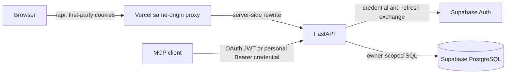
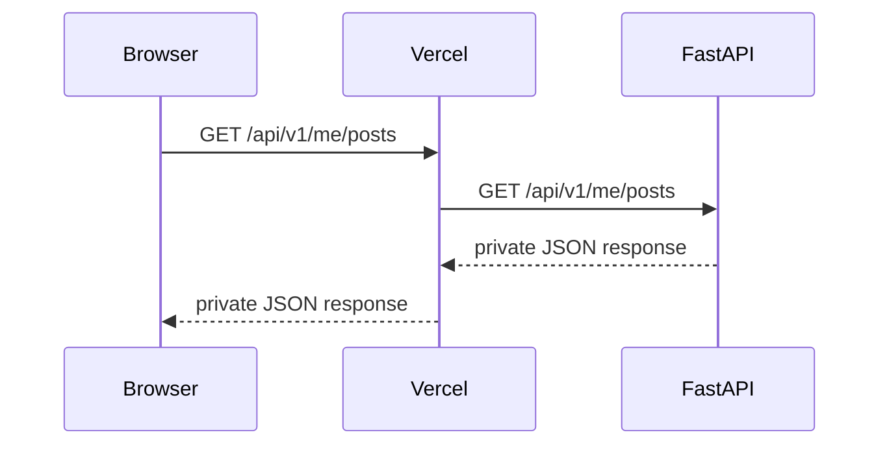
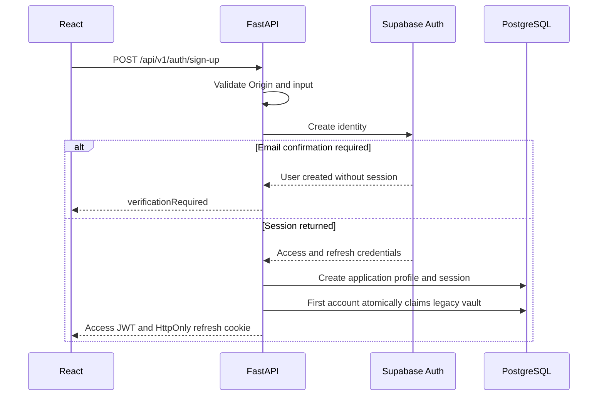
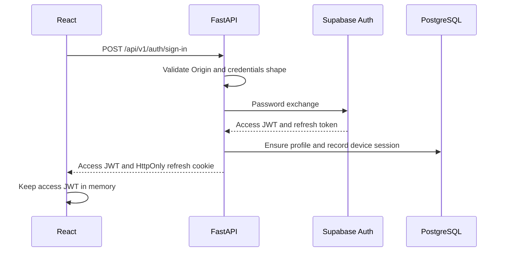
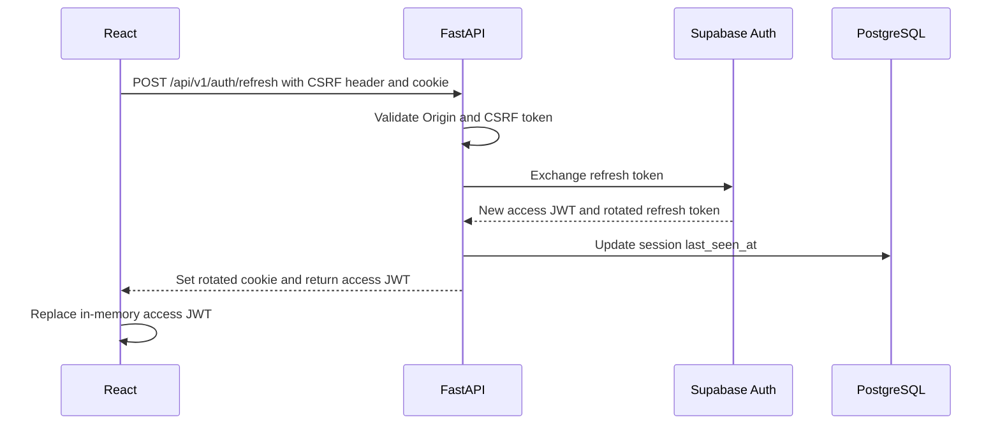
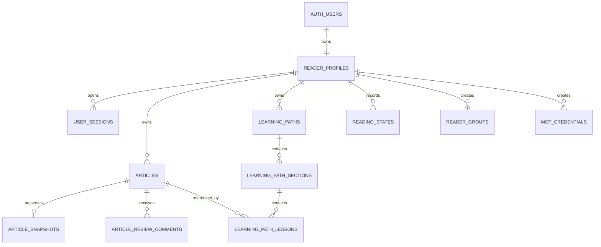
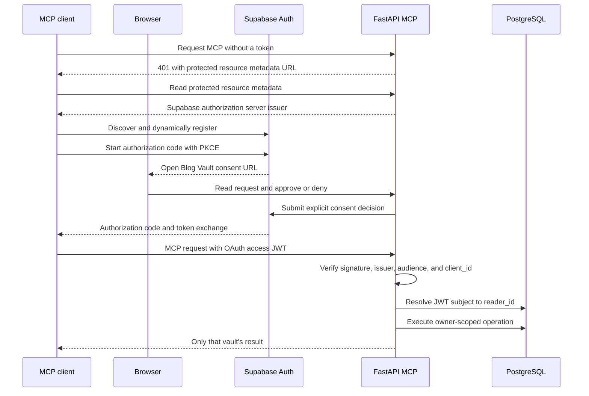
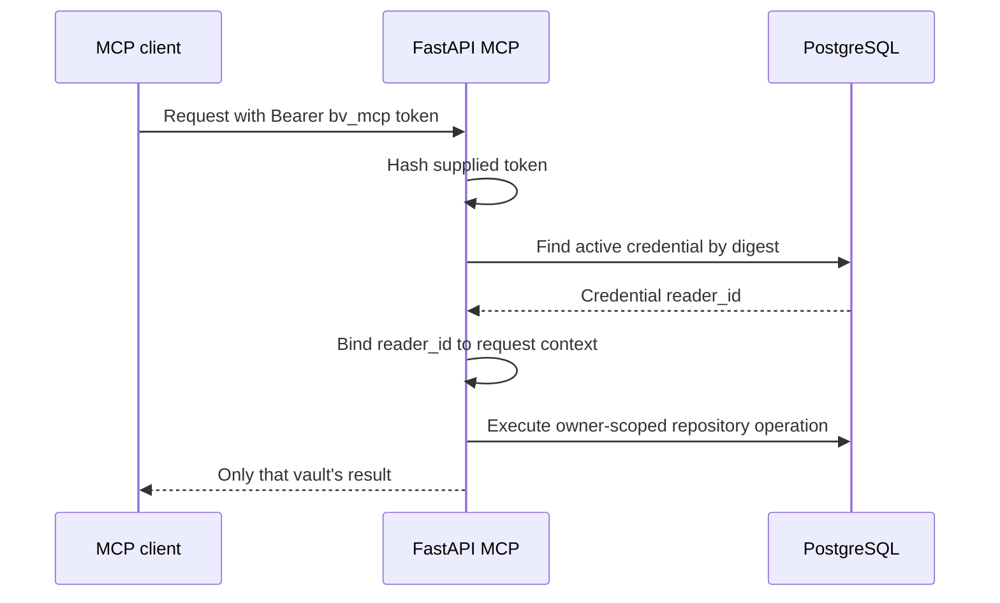
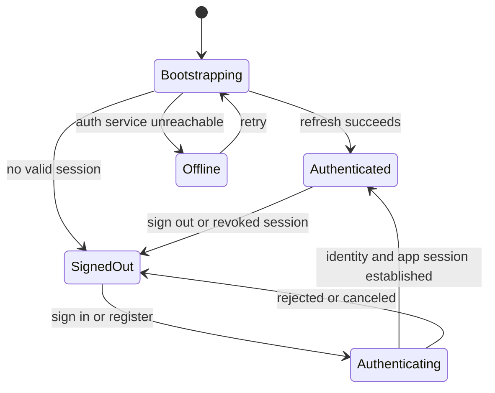

# Signup-only authentication and private-vault architecture

Status: implemented design

Identity provider: Supabase Auth

Application API: FastAPI

Browser: React through a same-origin Vercel proxy

Database: Supabase PostgreSQL

MCP: FastAPI Streamable HTTP with Supabase OAuth and personal credentials

## 1. Product decision

Blog Vault has no anonymous reader mode and no public article mode.

- A visitor may register, sign in, recover an account, or complete OAuth.
- A signed-out visitor cannot list or fetch articles, paths, reviews, or reader
  state.
- Every account owns an isolated vault.
- Browser requests derive ownership from a verified Supabase access JWT.
- MCP requests derive ownership from a Supabase OAuth JWT or personal credential.
- Neither client may send a `reader_id` to select a vault.

The database may still use the workflow word `published`. It means “approved and
visible inside its owner's reader,” not “publicly accessible.”

## 2. Trust boundaries



The browser trusts Vercel as the one public origin. Vercel does not authenticate
the user; it forwards `/api/*` to FastAPI. FastAPI is the authorization
boundary.

Supabase Auth owns passwords, OAuth identities, email verification, recovery,
and refresh-token issuance. The application does not store passwords or provider
access tokens.

PostgreSQL owns application profiles, device-session records, vault data, and
MCP credential hashes.

## 3. Why the proxy is required

In production the user opens:

```text
https://your-blog.vercel.app
```

React calls relative paths such as:

```text
/api/v1/auth/refresh
/api/v1/me/posts
```

Vercel rewrites these requests to Render internally. From the browser's point of
view, both the page and auth cookie belong to `your-blog.vercel.app`. This avoids
depending on third-party cookie behavior between `*.vercel.app` and
`*.onrender.com`.

The proxy is not a second API implementation. It is a routing layer:



MCP clients are not browsers and do not use the application's refresh cookie.
OAuth-capable clients connect directly to Render, discover Supabase Auth, and
manage their own OAuth access and refresh tokens. Other clients may use a
personal Bearer credential.

## 4. Token model

### Browser access token

- Short-lived Supabase JWT.
- Returned to React after sign-in or refresh.
- Held only in JavaScript memory.
- Sent in `Authorization: Bearer ...`.
- Lost on reload, which is intentional.

### Browser refresh token

- Supabase refresh credential.
- Stored in a `Secure`, `HttpOnly`, host-scoped, `SameSite=Lax` cookie.
- Unavailable to React and therefore harder for injected JavaScript to steal.
- Rotated by Supabase on refresh.

### CSRF token

- Non-secret random value in a readable same-site cookie.
- Also sent in `X-CSRF-Token` for cookie-authenticated mutations.
- Compared by FastAPI together with an exact Origin check.

### Personal MCP token

- High-entropy value prefixed with `bv_mcp_`.
- Displayed once when the user creates it.
- Stored by the MCP client, never by the React app.
- Stored in PostgreSQL only as a SHA-256 digest.
- Resolves to one `reader_id`.
- Individually revocable.

### MCP OAuth token

- Supabase JWT issued through authorization code with PKCE.
- Stored and refreshed by the connecting MCP client, not by React.
- Contains an OAuth-only `client_id` claim.
- Signature, issuer, audience, expiration, role, client ID, and subject are
  verified by FastAPI.
- Subject resolves to the same `reader_id` used by browser sessions.

## 5. Browser flows

### Registration



The first-account claim uses a PostgreSQL advisory transaction lock. Within the
same transaction, FastAPI checks whether an owned article already exists. If it
does not, it assigns every legacy unowned article and learning path to the new
profile. Concurrent registrations serialize at this point.

### Sign-in



### Refresh



This diagram deliberately uses one message per Mermaid line; it avoids the
GitHub sequence-diagram parse failure caused by placing a second message after a
semicolon.

### Sign-out

FastAPI revokes the provider session where possible, marks the application
session revoked, expires both cookies, and React clears its in-memory access
token.

### OAuth

OAuth uses authorization code with PKCE. FastAPI creates the verifier and state,
sets short-lived protected cookies, and returns the allowlisted Supabase
authorization URL. The callback validates state, exchanges the code, establishes
the same application session used by password sign-in, then redirects only to an
allowlisted application path.

## 6. Request authorization

For every `/api/v1/me/*` request:

1. Extract a strict Bearer token.
2. Verify signature with Supabase JWKS.
3. Verify issuer, audience, expiration, subject, session ID, and assurance level.
4. Resolve the matching application profile and non-revoked session.
5. Produce an internal principal containing `reader_id`.
6. Construct repositories bound to that `reader_id`.
7. Include the owner predicate in every root query.

Conceptually:

```sql
select *
from articles
where owner_reader_id = :principal_reader_id
  and slug = :slug;
```

Returning `404` for a foreign identifier avoids confirming whether another
vault contains it.

## 7. Data model



Important constraints:

```text
reader_profiles.auth_user_id          unique, required for active accounts
articles(owner_reader_id, slug)       unique per vault
learning_paths(owner_reader_id, slug) unique per vault
mcp_credentials.token_hash            globally unique
```

`owner_reader_id` is temporarily nullable only to support the one-time legacy
claim. Application writes always provide it.

Deleting a profile cascades to private vault data. Account deletion should be a
deliberate future workflow with a confirmation delay and export option; it is
not exposed by the current UI.

## 8. MCP authorization

### OAuth-capable connector



Supabase owns authorization codes, PKCE validation, grants, access tokens,
refresh rotation, dynamic registration, and redirect URI validation. Blog Vault
owns the consent presentation and the resource-server authorization decision.
The consent screen never approves automatically.

### Personal credential



The token verifier updates personal-token `last_used_at` at most once every five
minutes to avoid a database write on every tool call. Personal-token revocation
takes effect on the next request. OAuth grants and refresh-token rotation remain
owned by Supabase.

MCP tools may draft and revise. Human-only REST actions retain the approval,
publish, discard, rollback, and delete boundaries.

## 9. Frontend state machine



The private app component is not mounted until `Authenticated`. This matters:
merely hiding content with CSS would still allow effects to fetch private data.
Unmounting the app prevents those requests from starting.

There is no guest persistence or local-to-cloud import. Local Storage contains
only non-sensitive visual convenience values such as the selected theme and
active path slug. It contains no access token, refresh token, article body,
bookmark state, or owner identity.

## 10. Session management

The application records:

- provider auth user ID;
- provider session ID;
- created, last-seen, expiry, and revocation timestamps;
- a privacy-conscious device label;
- an HMAC-derived network fingerprint when configured.

The account page lists the user's devices and can revoke one other session or
all other sessions. It never displays raw refresh tokens, full IP addresses, or
provider secrets.

Idle and absolute session windows are enforced independently of the JWT's short
expiration. A valid JWT attached to a revoked application session is rejected.

## 11. Security invariants

- No private endpoint accepts `reader_id` from the browser or MCP payload.
- No article or path query omits its owner predicate.
- No access or refresh token enters Local Storage, Session Storage, IndexedDB,
  URLs, logs, or Langfuse traces.
- Passwords are forwarded only to Supabase over TLS and are never persisted.
- Refresh cookies are host-scoped, HttpOnly, Secure in production, and same-site.
- Cookie-authenticated mutations validate exact Origin and CSRF.
- OAuth redirect destinations are allowlisted.
- MCP plaintext tokens are displayed once and never recoverable from storage.
- Revoked browser sessions and MCP credentials fail closed.
- Review publication remains a human action.

## 12. Deployment checklist

Supabase:

1. Configure an asymmetric JWT signing key.
2. Enable email/password and selected OAuth providers.
3. Add the exact callback URL.
4. Keep email confirmation enabled.
5. Configure SMTP before production email traffic.
6. Apply every Alembic migration.
7. Enable OAuth Server and set Authorization Path to `/oauth/consent`.
8. Enable Dynamic Client Registration for automatic MCP client registration.
9. Set Site URL to the Vercel origin.

Render:

1. Set database, Supabase, callback, allowed-origin, and cookie variables.
2. Keep secrets only in Render's environment settings.
3. Run migrations before starting FastAPI.
4. Do not configure a shared MCP token.

Vercel:

1. Keep `VITE_API_URL=/api/v1`.
2. Keep `/api/*` rewrite before the SPA fallback.
3. Set the exact Vercel origin in FastAPI's allowlists.

Verification:

1. A signed-out `/api/v1/me/posts` call returns `401`.
2. Registration establishes or requests verification for an account.
3. The first account sees the migrated legacy vault.
4. A second account sees an empty vault.
5. Cross-account slugs and article IDs return `404`.
6. Refresh survives a page reload without browser-readable refresh material.
7. Session revocation rejects subsequent requests.
8. A revoked MCP credential returns `401`.
9. MCP protected-resource discovery names the Supabase issuer.
10. An OAuth token without `client_id` returns `401` at MCP.
11. OAuth consent can be approved and denied from the Vercel consent screen.
12. One user's MCP credential cannot observe another user's data.

## 13. Explicit non-goals

- Anonymous or public articles.
- Guest bookmarks or guest progress.
- Browser-selected ownership.
- Shared site-wide MCP credentials.
- Permanent article version history.
- Automatic LLM publication.
- Storing OAuth provider tokens for unrelated API access.
